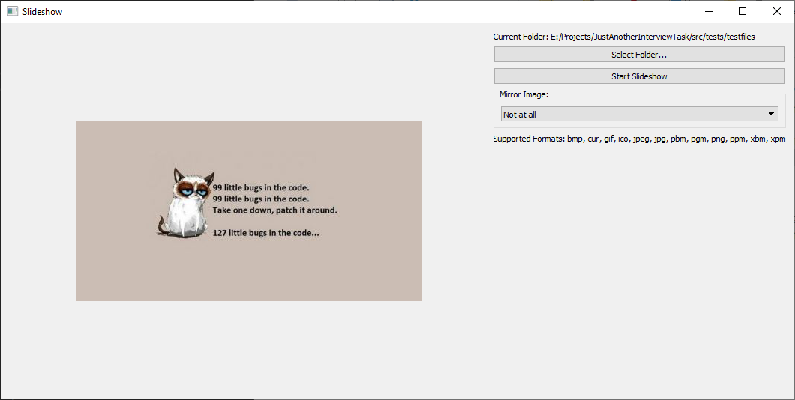

[](https://opensource.org/licenses/MIT)
[](https://travis-ci.com/DonRomanos/JustAnotherInterviewTask.svg?branch=master)

# A task for an Interview using Qt and C++

A Qt Application running a slideshow of images in a selected folder. Image loading had to be non-blocking, also provides an option to mirror images along the horizontal or vertical axis.



## Requirements

* CMake
* Qt
* C++17 Compiler
* Conan (Recommended but optional)
* Catch2 (if you want to run the tests)


## My thoughts

I focussed on simple code, not dealing with threading directly but using the modern C++ facilities for an easy and straightforward implementation.

Here are some assumptions that I did which I would normally discuss with the PO. Which are as follows:

* Supported formats depend on the qt and plugins installation with the provided conan file it should be .bmp, .jpg and few others
* For images that have a supported extension but cannot be loaded an error message is shown in the display
* If the folder is empty the display will show an error message
* After reaching the end of the folder the slideshow will restart from the beginning (reloading the folder content)
* Images that take longer than 2 seconds to load will block the UI (as the UI will wait for the image in that case, should not really happen with "normal" images)
* There is no special handling for files added or deleted during the slideshow
* When changing the mirror mode the UI will wait for the operation to complete (so its possible for it to block, but was never noticeable for me)

Some other ideas that can be implemented if necessary

* Could use a condition variable to signal the availability of an image then we would not block the ui even if loading takes longer than 2 seconds
* If an image is not loadable we could try loading until we reach one thats loadable

## How to setup

**Note**: I tested this with VS2019 and GCC-9 on WSL2.

With Conan:

Installing the Libraries using Conan (I recommend using a [conan profile](https://docs.conan.io/en/latest/reference/profiles.html) to specify your settings, e.g. run conan install .. -p gcc-9 ...)

```shell
conan remote add catchorg https://api.bintray.com/conan/catchorg/Catch2
conan remote add bincrafters https://api.bintray.com/conan/bincrafters/public-conan

mkdir build && cd build
conan install .. --build missing
conan build ..
```

Now you should see the library successfully compiling and running the tests.

### Disabling some of the Dependencies

If you don't have the dependencies or dont want to build with them for some reason you can disable them with these CMake Options, simply set them to 'OFF'. (If CMake cannot find Catch2 it will automatically turn them off)

```cmake
BUILD_TESTS
```

### Alternative without Conan

Requirements:

* CMake

You can build the library without Conan if you manually install Qt (and Catch2 if you want to build the tests) and point cmake to it.

Just tell Cmake where to find them by setting following CMake Variables

```cmake
Qt5_DIR
Catch2_DIR (optional)
``` 

**Note**: CMake should take care of copying required shared libraries and setting up the platforms folder, if not you should do it manually. Otherwise you will get runtime errors.

## Learnings

My first approach was based on passing and copying a directory_iterator, until I found out that directory_iterator is not really copyable but behaves like a handle (which makes sense if you think about it, but is confusing if you pass by value, think you're modifying the copy but modify both instead...). Also I had quite some trouble with Conan and Qt, as the packages are not up to date and cause problems especially on Linux. On travis the build fails because the logs for building qt are too long now...

**A little something about the architecture**

I tried to keep the logic in the UI to the minimum. Therefore all the next handling is done within ImageProvider. This makes testing easier and looks quite elegant to me. This was not the first approach though :)